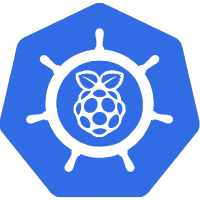

# Home

<!-- markdownlint-disable first-line-heading line-length -->

<!-- markdownlint-disable no-trailing-punctuation -->
### My Kubernetes Cluster (k3s) managed by GitOps (Flux2)

 
 
 

[-A22846?logo=raspberrypi&logoColor=A22846&style=for-the-badge)](https://www.raspberrypi.org/)

